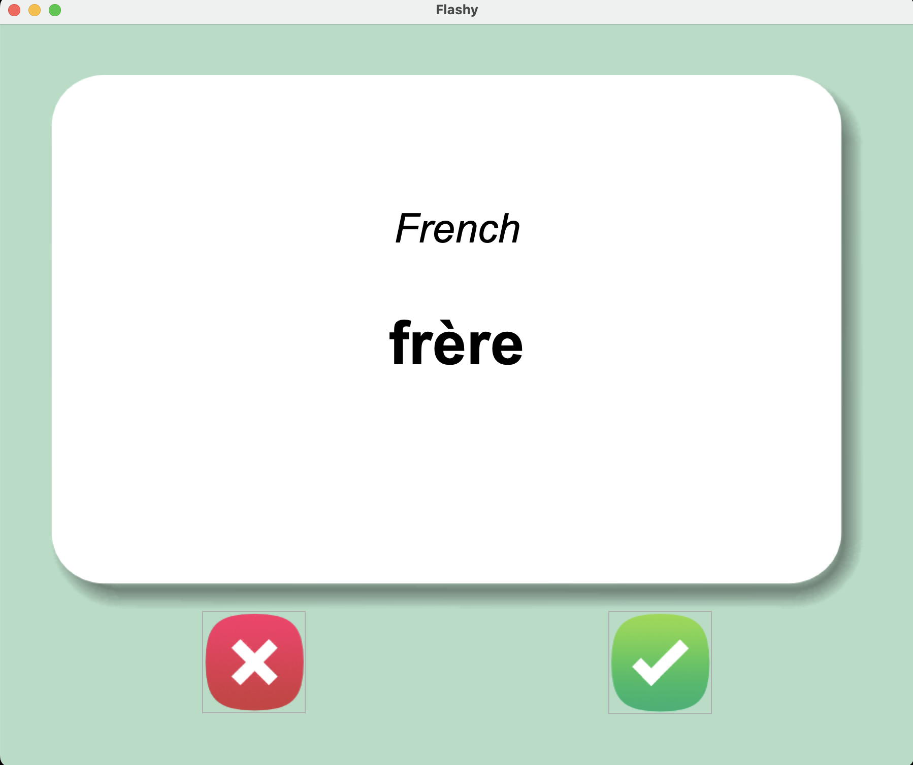
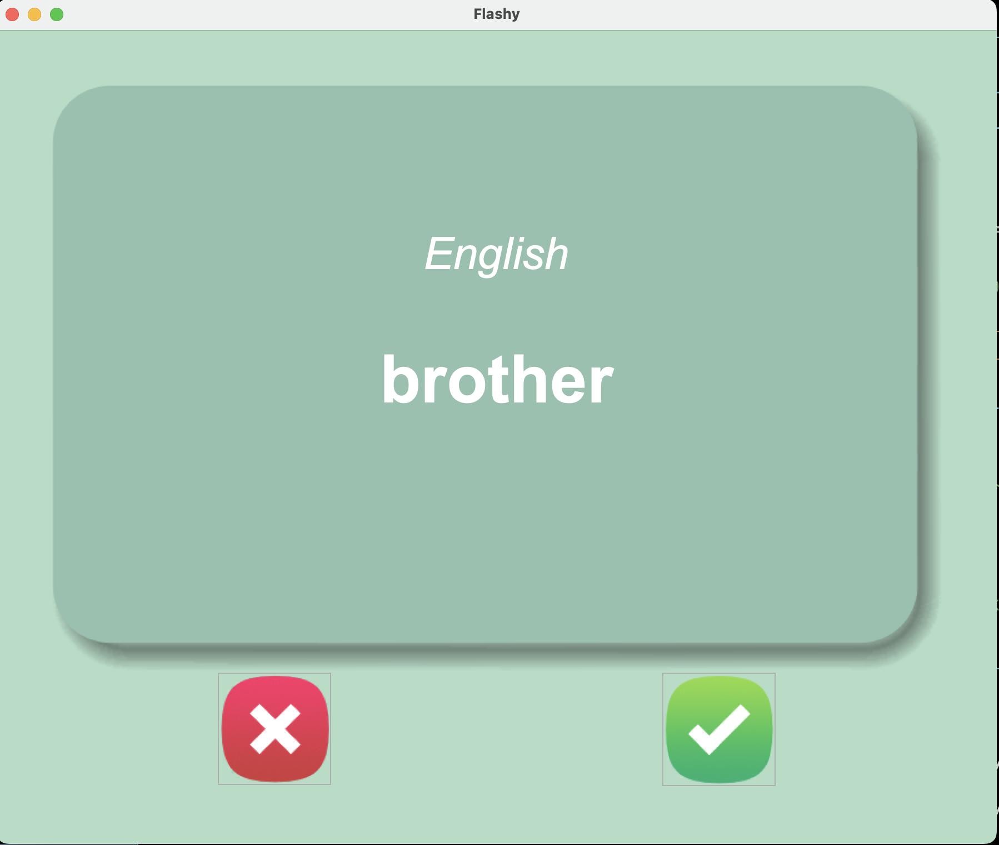

# Flash Cards 

  ## Description

  This is a Flash Card app built with Python using the tkinter module for the UI.  It randomly chooses from a list of French words and after 3 seconds will flip to the opposite side of the card to show the English translation.   The user can let the app know when a word is known, so it removes it from the list of words to learn.

  Screenshot of Side 1 of a Flashcard (French Word):

  
  
  Screenshot of Side 2 of a Flashcard (English Translation):
  

  ## Table of Contents
  
  - [Installation](#installation)
  - [Usage](#usage)
  - [License](#license)
  - [Contributing](#contributing)
  - [Tests](#tests)
  - [Questions](#questions)
  
  ## Installation
  
  run main.py from the terminal
  
  ## Usage
  
  click green checkmark when a word is known to remove it from this of words to learn.  click the red x if you want to keep it in the list of words to learn so that it pops up again.

  ## License
This application is covered under the MIT License.
 For more information: https://opensource.org/licenses/MIT
  
  ## Contributing
  N/A
  
  ## Tests
  N/A

  ## Questions
  Contact Info 
  GitHub user name: BillStephens2022 
  Link to GitHub profile: https://github.com/BillStephens2022 
  Email: stephensbill17@gmail.com
